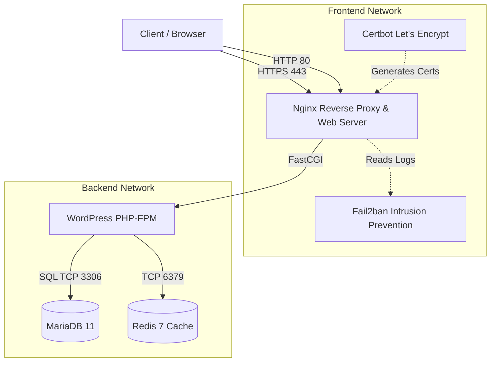
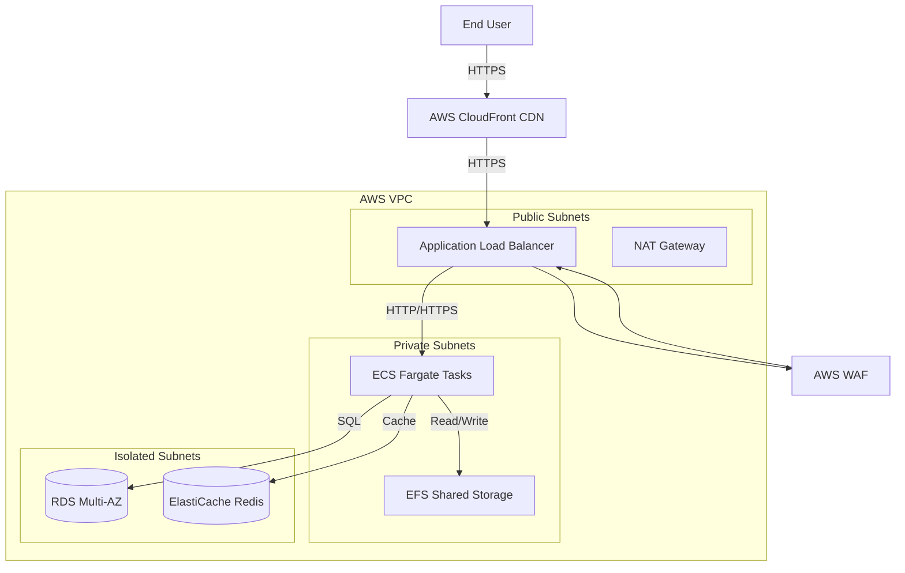

# Enterprise WordPress 2026 — Architecture Overview

This document outlines the architectural design of the Enterprise WordPress 2026 stack, covering both the Docker Compose runtime architecture and the AWS Infrastructure deployment.

## 1. Docker Compose Runtime Architecture

The application runs as a multi-container Docker Compose stack designed for high performance, security, and scalability.

### Components:
- **Nginx**: Acts as the reverse proxy, handles SSL termination, serves static assets directly, and manages the FastCGI cache.
- **WordPress (PHP-FPM)**: Executes dynamic PHP code. Tuned for high concurrency with dynamic process management.
- **MariaDB 11**: The primary relational database.
- **Redis 7**: An in-memory data structure store used for Object Caching, significantly reducing database queries.
- **Certbot**: Automatically provisions and renews SSL certificates via Let's Encrypt.
- **Fail2ban**: Monitors Nginx logs for malicious activity and automatically bans offending IP addresses.

## 2. AWS Infrastructure Architecture (Terraform)

For true enterprise scale, this repository includes Terraform configurations to deploy the stack to AWS.

### AWS Components:
- **CloudFront**: Edge caching for static assets and global content delivery.
- **ALB & WAF**: Application Load Balancer for routing traffic to ECS, protected by Web Application Firewall rules.
- **ECS Fargate**: Serverless compute for running the WordPress Docker containers.
- **RDS Multi-AZ**: Highly available managed database for WordPress data.
- **EFS**: Elastic File System to share the `wp-content/uploads` directory across multiple ECS instances.
